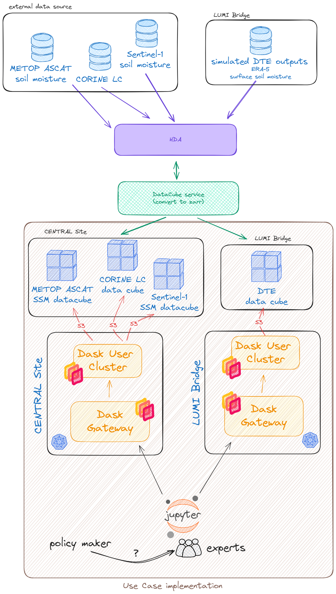

# DestinE_EUMETSAT_ItalyDrought_2022
Use case demonstration of DestinE Data Lake service for the disaster response assessment following the drought in Italy in 2022.

An overview about how the use case was implemented and the given data flow is given in the following.

## Demonstration

### Demonstration METOP ASCAT SM
First the current drought situation is investigated and affected areas are delineated on a map. Data produced by HSAF service of EUMETSAT is used to depict the current situation in March 2022. Affected areas are deduced by incorporating information about the major land cover classes provided by the CORINE LC dataset.

Outputs of the Climate Change Adaptation Digital Twin, simulated by ERA5 data, are used to forecast future drought affected areas. Soil moiture is used as climate variable indicating droughts for the area of Italy.  

The modelled scenario is evaluate based on observations provided by the meteorological satellites METOP for the summer period of 2022. As can be seen in the following, the gathered satellite observations confirm the DT outputs initally used to forecast the severity of the potential drought event.

Details about how the data was produced can be found in the given IPython notebook

## Usage and Limitations
### Run in local JupyterLab
Create a conda/micromamba environmnent and install required packages as given in the conda-env.yml

``
micromamba create -n dedl_usecase -f conda-env.yml --yes
``

Install Jupyterlab in the newly created environement or make use of VSCode to run through the notebook.

### Limitations
To make use of the DEDL Stack Service Dask, a user needs to be registered and granted access with the corresponding DEDL services.

Data used in the demonstration is located in a private bucket.